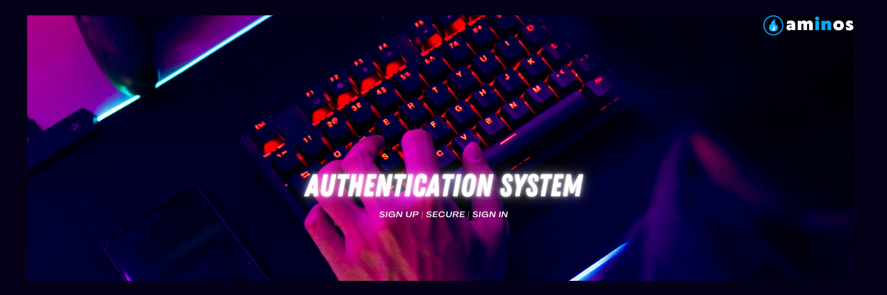

    

<h2 align="center">Authentication System with bycrypt & JWT in JavaScript</h2>

 

 

 
 

 
 

<h2 align="left" style="font-weight:bold">📰 License</h2>

> **Developed &amp; maintained by the [@devstrons](https://github.com/devstrons). Copyright 2022 © aminoxix.**
